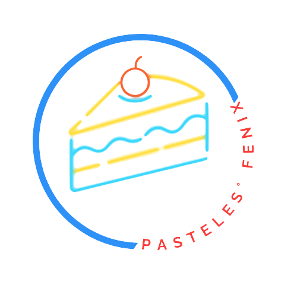
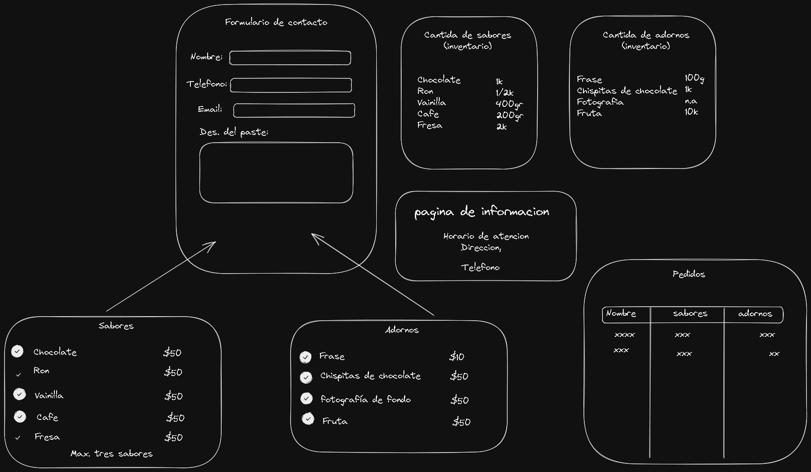

# Practica de luanch_x_latam misionFronEnd
Practica de html, tengo que realizar lo siguiente:

- Crear marca de la pastelería como un logo y los mensajes que daremos desde la marca.
- Maquetación de páginas de cliente de la pastelería.
- Maquetación de páginas del pastelero.
## TODO:

- Crear una marca
    ### Pasteleria el fenix; el sabor del mañana;

- Crear un logo

- Crear un lema o similar
    ### El sabor del mañana && 

- Maquetar 

### Home Page(pagina de informacion)

[home](./index.html)

### Formulario de contacto

[PedidoFormulario](./pages/pedidoFormulario.html)

### Tabla de pedido

[TablaPedidos](./pages/pedidosTablasPage.html)

### Adornos Inventario

[AdornosInventarioPage](./pages/adornosInventarioPage.html.html)

### Sabores Inventario

[SaboresInventarioPage](./pages/saboresInventarioPage.html)

Bonus:
En caso de que te quede corto el ejercicio siguele con esto!
- Bonus de estilos (Intro a CSS)
- Bonus de Rutas (Navegación en la página)
- Bonus de despliegue (Montar la página en línea con dominio gratuito)